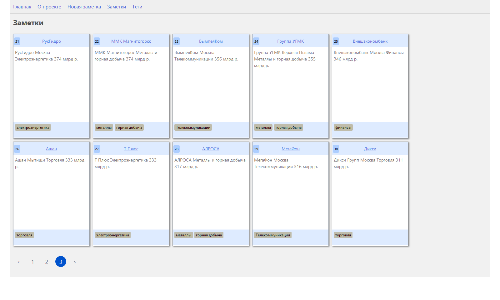

# react-redux-notes

Заметки на React + Redux

проект в разработке...

## Установка

Cтавим yarn, если не установлен
```bash
npm install --global yarn
```

Инсталяция приложения
```bash
cd react-redux-notes

yarn
```

## Запуск dev-сервера

```bash
yarn start
```

## Скриншот
